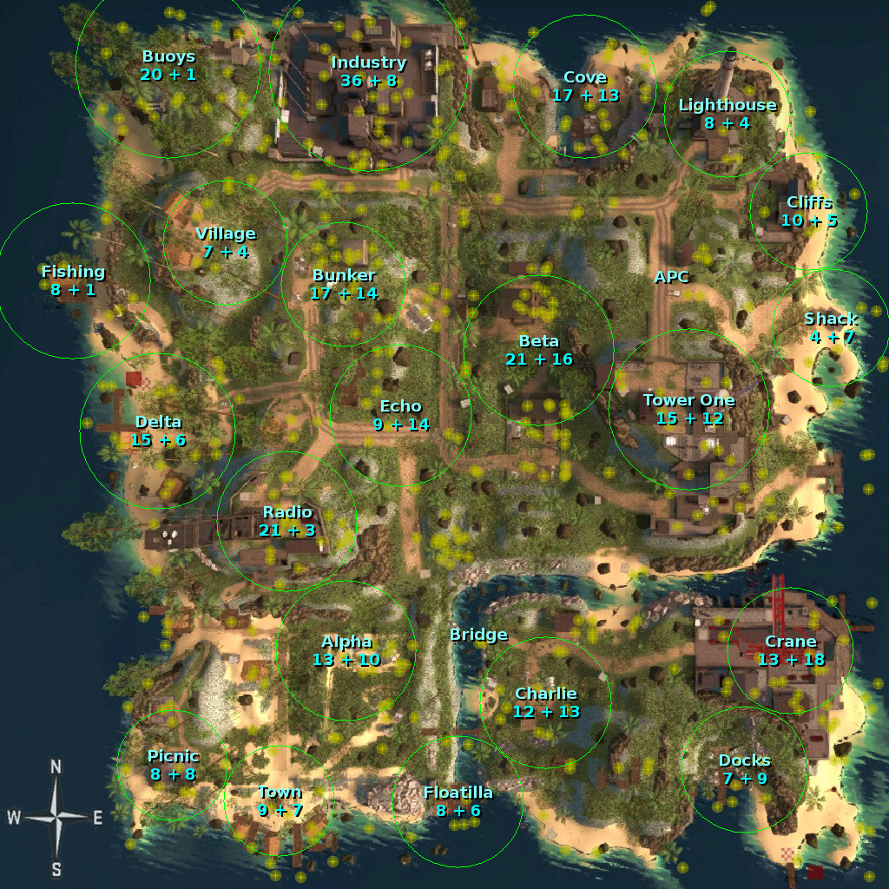

Danger Zone maps, annotated with loot density
=============================================

As of 2020-02-05, the three maps available in CS:GO's Danger Zone are:

* Blacksite - the original and (arguably) the best. Lots of named locations
  (some of which aren't very interesting), lots of loot drops, well known.
* Sirocco - the one that introduced us to exo-jump. Not as many named locations
  as on Blacksite, but they cover a bit more area each. Also well known.
* Junglety - created by community mapper michal3210. Formerly had only 300ish
  loot spawns, which caused some small problems for the map; see [Feb 2020 Jungle Update](jungle202002).

In order to analyze the loot distribution, I created a quick dump of all the
loot spawns and the map named locations. This was done using [this code](https://github.com/Rosuav/TF2BuffBot/blob/3d8fc6a/drzed.sp#L1695-L1726)
once for each map. The maps themselves come from the dz_*_radar.dds files in
the dedicated server directory. Then [map_entities.pike](https://github.com/Rosuav/shed/blob/master/map_entities.pike)
takes all of that and creates annotated images, seen below.

The locations deemed "uninteresting" were chosen manually, and in some cases
are a little arbitrary. Feel free to redefine this.

---

---

---

